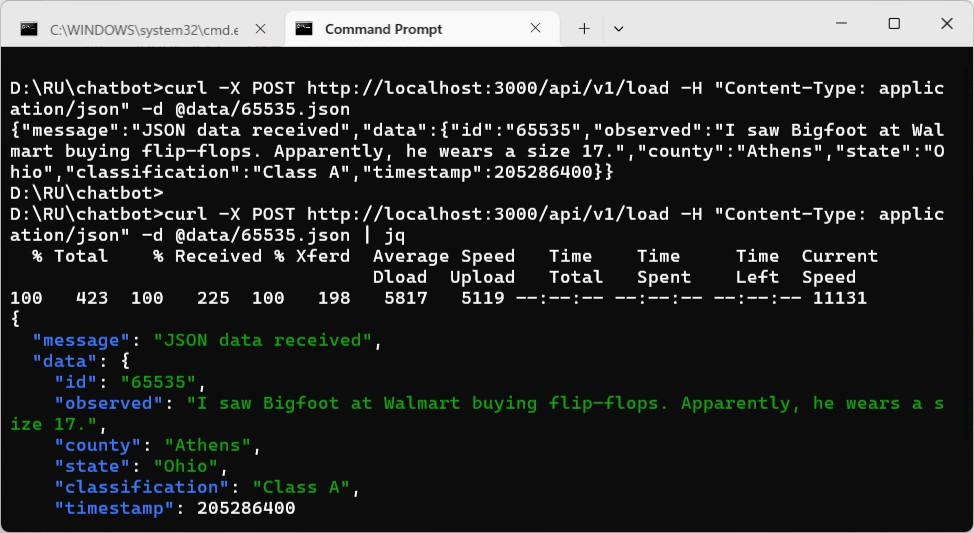
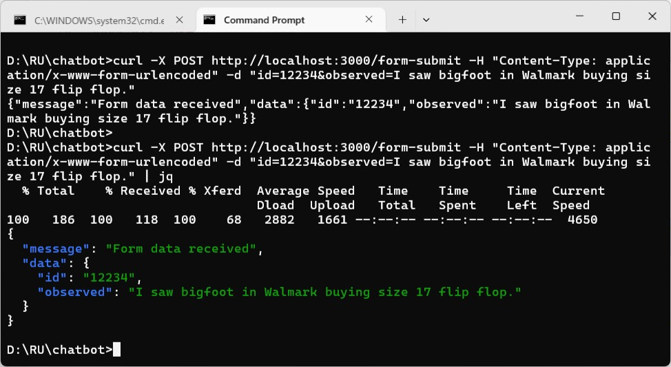
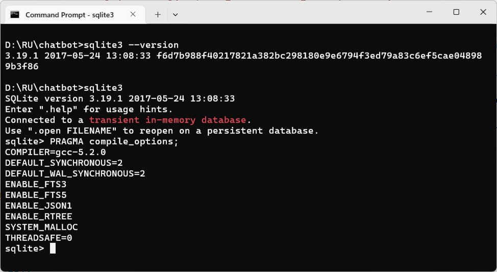
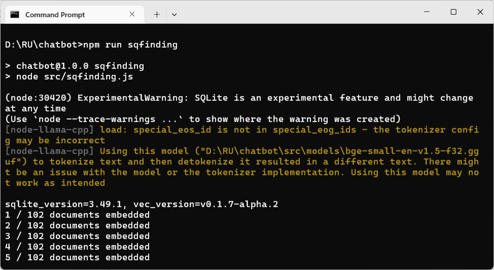
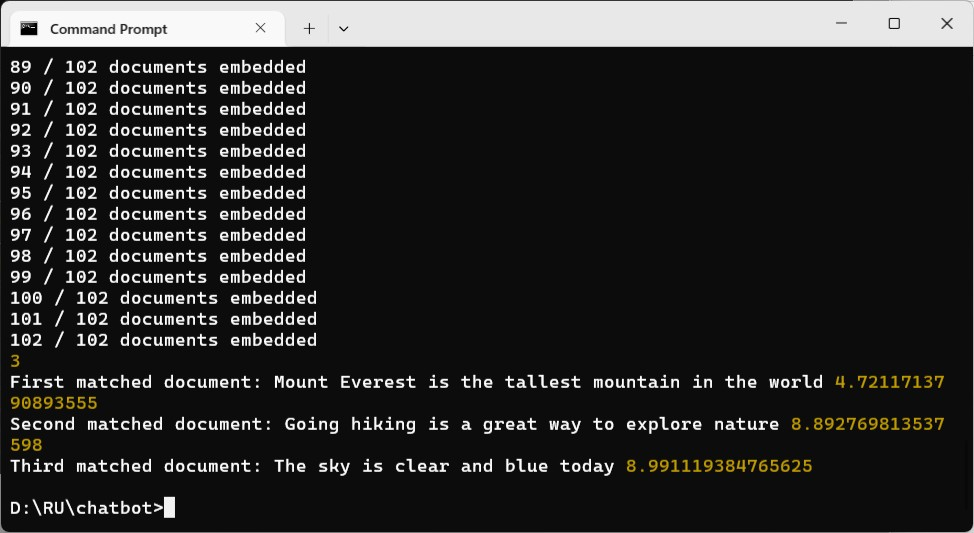
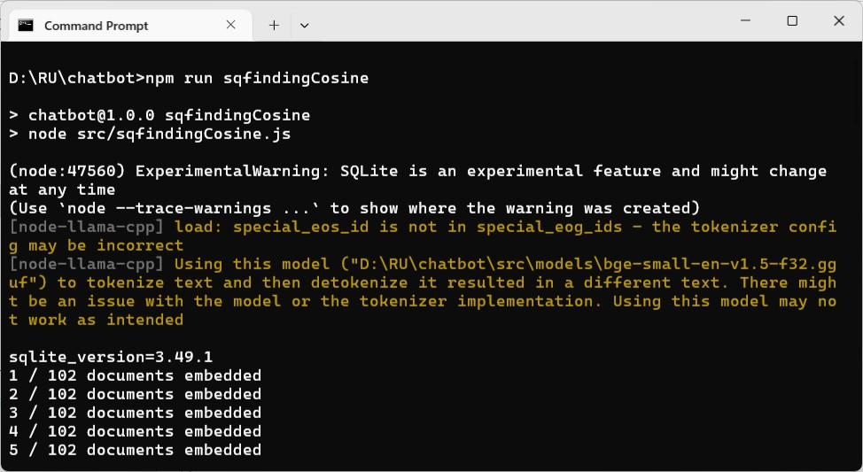

### ChatBot


#### Prologue 
> The sky was so starry, so bright that, looking at it, one could not help asking oneself whether ill-humoured and capricious people could live under such a sky. 


#### I. LangChain
**Pros:**
1. **Simplified Integration**: LangChain abstracts much of the complexity involved in integrating large language models (LLMs) into applications, making it easier for developers[1](https://dev.to/alexroor4/the-pros-and-cons-of-langchain-for-beginner-developers-25a7).
2. **Comprehensive Documentation**: It offers extensive documentation and examples, which is particularly helpful for beginners[1](https://dev.to/alexroor4/the-pros-and-cons-of-langchain-for-beginner-developers-25a7).
3. **Modularity and Extensibility**: LangChain is designed with modularity in mind, allowing developers to pick and choose components as needed[1](https://dev.to/alexroor4/the-pros-and-cons-of-langchain-for-beginner-developers-25a7).
4. **Support for Multiple LLMs**: It supports various LLMs, including OpenAI GPT, Cohere, and Hugging Face models, providing flexibility[1](https://dev.to/alexroor4/the-pros-and-cons-of-langchain-for-beginner-developers-25a7).
5. **Active Community**: LangChain has an active community, offering ample support and resources[1](https://dev.to/alexroor4/the-pros-and-cons-of-langchain-for-beginner-developers-25a7).

**Cons:**
1. **Learning Curve**: Despite its aim to simplify LLM integration, LangChain itself has a learning curve, especially for beginners[1](https://dev.to/alexroor4/the-pros-and-cons-of-langchain-for-beginner-developers-25a7).
2. **Abstracted Complexity**: The abstraction can sometimes prevent developers from fully understanding how LLMs work, which can be a disadvantage when deeper customization is required[1](https://dev.to/alexroor4/the-pros-and-cons-of-langchain-for-beginner-developers-25a7).
3. **Performance Overheads**: The convenience of using a high-level tool like LangChain can come at the cost of performance overheads[1](https://dev.to/alexroor4/the-pros-and-cons-of-langchain-for-beginner-developers-25a7).
4. **Dependency Management**: LangChain relies on various dependencies, which might lead to version conflicts or other dependency management issues[1](https://dev.to/alexroor4/the-pros-and-cons-of-langchain-for-beginner-developers-25a7).


#### II. llama.cpp
**Pros:**
1. **Efficient Inference**: llama.cpp provides fast model inference with low memory usage, making it suitable for running on consumer-grade hardware[2](https://picovoice.ai/blog/local-llms-llamacpp-ollama/)[3](https://www.belsterns.com/post/ollama-vs-llama-cpp-which-one-should-you-choose-in-2025).
2. **Portability**: It allows running LLaMA models on standard PCs and laptops without requiring high-end GPUs[2](https://picovoice.ai/blog/local-llms-llamacpp-ollama/)[3](https://www.belsterns.com/post/ollama-vs-llama-cpp-which-one-should-you-choose-in-2025).
3. **Quantization Support**: Supports various quantization techniques to reduce model size and memory usage while maintaining performance[2](https://picovoice.ai/blog/local-llms-llamacpp-ollama/)[3](https://www.belsterns.com/post/ollama-vs-llama-cpp-which-one-should-you-choose-in-2025).
4. **Open-Source**: Being open-source, it offers greater flexibility for modifying and integrating custom features[2](https://picovoice.ai/blog/local-llms-llamacpp-ollama/)[3](https://www.belsterns.com/post/ollama-vs-llama-cpp-which-one-should-you-choose-in-2025).

**Cons:**
1. **Setup and Configuration**: Requires more setup and configuration compared to higher-level tools[4](https://best-of-web.builder.io/library/abetlen/llama-cpp-python).
2. **Limited Documentation**: While it has a growing community, the documentation might not be as comprehensive as LangChain's[2](https://picovoice.ai/blog/local-llms-llamacpp-ollama/).
3. **Manual Management**: Developers need to handle more aspects manually, which can be challenging for those not familiar with low-level programming[3](https://www.belsterns.com/post/ollama-vs-llama-cpp-which-one-should-you-choose-in-2025).

Both tools have their strengths and are suited for different use cases. LangChain is great for those looking for a high-level, easy-to-integrate solution with extensive support, while llama.cpp is ideal for developers who need efficient performance on standard hardware and are comfortable with more manual setup and configuration.


#### III. Metal
**Metal** is a low-level, low-overhead hardware-accelerated 3D graphics and compute API created by Apple. It is designed to provide near-direct access to the GPU, improving performance for graphics-intensive applications and computational tasks on iOS, iPadOS, macOS, and tvOS[1](https://en.wikipedia.org/wiki/Metal_%28API%29)[2](https://developer.apple.com/metal/).

**Key Features:**
- **Low Overhead**: Reduces CPU overhead by allowing direct control over GPU tasks[1](https://en.wikipedia.org/wiki/Metal_%28API%29).
- **Unified API**: Combines graphics and compute functions, similar to OpenGL and OpenCL[1](https://en.wikipedia.org/wiki/Metal_%28API%29).
- **Optimized for Apple Hardware**: Takes full advantage of Apple silicon, including support for advanced features like ray tracing and neural network processing[2](https://developer.apple.com/metal/).
- **Shading Language**: Uses the Metal Shading Language (MSL), which is based on C++[1](https://en.wikipedia.org/wiki/Metal_%28API%29).


#### IV. CUDA
**CUDA** (Compute Unified Device Architecture) is a parallel computing platform and API model developed by NVIDIA. It enables developers to use NVIDIA GPUs for general-purpose processing (GPGPU) to accelerate computing tasks[3](https://developer.apple.com/documentation/metal).

**Key Features:**
- **Parallel Computing**: Allows execution of thousands of threads simultaneously, leveraging the parallel processing power of GPUs[3](https://developer.apple.com/documentation/metal).
- **Support for Multiple Languages**: Compatible with C, C++, Fortran, and Python[3](https://developer.apple.com/documentation/metal).
- **Optimized Libraries**: Includes GPU-accelerated libraries for various tasks such as linear algebra, image processing, and deep learning[1](https://en.wikipedia.org/wiki/Metal_%28API%29).
- **Development Tools**: Provides debugging and optimization tools, a C/C++ compiler, and a runtime library[1](https://en.wikipedia.org/wiki/Metal_%28API%29).


#### V. Vulkan
**Vulkan** is a low-level, cross-platform API for 3D graphics and computing, maintained by the Khronos Group. It is designed to offer higher performance and more efficient CPU and GPU usage compared to older APIs like OpenGL[4](https://en.wikipedia.org/wiki/Vulkan)[5](https://developer.nvidia.com/vulkan).

**Key Features:**
- **Low Overhead**: Provides direct control over the GPU, reducing CPU usage and improving performance[4](https://en.wikipedia.org/wiki/Vulkan).
- **Cross-Platform**: Supports a wide range of operating systems, including Windows, Linux, Android, and more[4](https://en.wikipedia.org/wiki/Vulkan).
- **Parallelism**: Designed to work efficiently with modern multi-core CPUs, allowing better distribution of work[4](https://en.wikipedia.org/wiki/Vulkan).
- **Open Standard**: As an open standard, it is supported by multiple hardware vendors and is highly portable[5](https://developer.nvidia.com/vulkan).

Each of these APIs has its own strengths and is suited for different use cases. Metal is optimized for Apple devices, CUDA is powerful for NVIDIA GPUs, and Vulkan offers cross-platform capabilities with low overhead.


#### VI. Models used
- [bge-reranker-v2-m3-Q8_0.gguf](https://huggingface.co/klnstpr/bge-reranker-v2-m3-Q8_0-GGUF/blob/main/bge-reranker-v2-m3-q8_0.gguf) : reranking.js
- [bge-small-en-v1.5-f32.gguf](https://huggingface.co/CompendiumLabs/bge-small-en-v1.5-gguf) : finding.js, vector.js, sqfinding.js, sqfindingCosine.js
- [codegemma-2b-Q4_K_M.gguf](https://huggingface.co/itlwas/codegemma-2b-Q4_K_M-GGUF/tree/main) : fillin.js 
- [Meta-Llama-3.1-8B-Instruct-Q3_K_M.gguf](https://huggingface.co/bartowski/Meta-Llama-3.1-8B-Instruct-GGUF) : completion.js, function.js, raw.js, schema.js, summarize.js
- [mistral-7b-instruct-v0.2.Q4_K_M.gguf](https://huggingface.co/TheBloke/Mistral-7B-Instruct-v0.2-GGUF) : chatbot.js 


#### VII. Useful utilities
##### 1. `inspect`
To check your hardware capabilities:
```
npx --no node-llama-cpp inspect gpu
```


##### 2. `estimate`
To get a more accurate estimation of how well a model will run on your hardware before downloading it: 
```
npx --no node-llama-cpp inspect estimate <model-file-url>
```


##### 3. `curl`
To send a POST request to a backend API is straightforward. Here’s a basic example of how you can do it:
```
curl -X POST http://localhost:3000/api/v1/load -H "Content-Type: application/json" -d "{ \"id\": \"65535\", \"observed\": \"I saw Bigfoot at Walmart buying flip-flops.\" }" -v
```


With JSON content from a file by using the `-d` option along with `@` followed by the file path. 
```
curl -X POST http://localhost:3000/api/v1/load -H "Content-Type: application/json" -d @data/65535.json
```

```65535.json
{ "id": "65535", "observed": "I saw Bigfoot at Walmart buying flip-flops. Apparently, he wears a size 17.", "county": "Athens", "state": "Ohio", "classification": "Class A", "timestamp": 205286400 }
```


With form Data
```
curl -X POST http://localhost:3000/form-submit -H "Content-Type: application/x-www-form-urlencoded" -d "id=12234&observed=I saw bigfoot in Walmark buying size 17 flip flop."
```



##### 4. [`jq`](https://github.com/stedolan/jq/releases/latest/download/jq-win64.exe)
A powerful command-line tool for processing JSON data. It's like `sed` for JSON data – you can use it to slice, filter, map, and transform structured data with ease. Here are some key features of `jq`:
- **JSON Parsing**: Reads JSON data and allows you to manipulate it.
- **Filtering**: Apply filters to extract specific parts of JSON data.
- **Transformation**: Modify JSON data, such as changing values or structure.
- **Pretty-Printing**: Format JSON data to make it more readable.

Example usage:
```
echo {"name": "John", "age": 30} | jq
echo {"name": "John", "age": 30} | jq .name
```
This command would output:
```
{
  "name": "John",
  "age": 30
}
"John"
```

##### 5. `pbpaste`
A command-line utility available on macOS that allows you to access the contents of the clipboard. It essentially pastes the clipboard content to the standard output (stdout), similar to using the keyboard shortcut Cmd + V. Here are some common uses:
- **Pasting Clipboard Content**: You can redirect the clipboard content to a file or another command.
- **Scripting**: Useful in scripts where you need to manipulate or use clipboard data.

Example usage:
```
pbpaste > output.txt
```
This command would paste the clipboard content into a file named `output.txt`. Alas! You may use [MS-DOS Commands :: paste](https://www.c3scripts.com/tutorials/msdos/paste.html) which needs [.NET Framework 3.5](https://dotnet.microsoft.com/en-us/download/dotnet-framework/net35-sp1?wt.mc_id=install-docs), to achieve similar effect. 

```
pbpaste | wc 
```


#### VIII. [sqlite-vec](https://github.com/asg017/sqlite-vec)
> This requires Node v23.5.0 or above.

Alex Garcia's [Blog](https://alexgarcia.xyz/blog/)
- 2024-05-02: [I'm writing a new vector search SQLite Extension](https://alexgarcia.xyz/blog/2024/building-new-vector-search-sqlite/index.html)
- 2024-05-23: [Vector search in 7 different programming languages using SQL](https://alexgarcia.xyz/blog/2024/sql-vector-search-languages/index.html)
- 2024-07-24: [Introducing sqlite-lembed: A SQLite extension for generating text embeddings locally](https://alexgarcia.xyz/blog/2024/sqlite-lembed-init/index.html)
- 2024-07-25: [Introducing sqlite-rembed: A SQLite extension for generating text embeddings from remote APIs](https://alexgarcia.xyz/blog/2024/sqlite-rembed-init/index.html)
- 2024-08-01: [Introducing sqlite-vec v0.1.0: a vector search SQLite extension that runs everywhere](https://alexgarcia.xyz/blog/2024/sqlite-vec-stable-release/index.html)
- 2024-10-02: [Hybrid full-text search and vector search with SQLite](https://alexgarcia.xyz/blog/2024/sqlite-vec-hybrid-search/index.html)
- 2024-11-20: [sqlite-vec now supports metadata columns and filtering](https://alexgarcia.xyz/blog/2024/sqlite-vec-metadata-release/index.html)

> [`sqlite-vec`](https://github.com/asg017/sqlite-vec), a SQLite extension for vector search, now supports [metadata columns](https://alexgarcia.xyz/sqlite-vec/features/vec0.html#metadata), [auxiliary columns](https://alexgarcia.xyz/sqlite-vec/features/vec0.html#aux), and [partitioning](https://alexgarcia.xyz/sqlite-vec/features/vec0.html#partition-keys) in vec0 virtual tables! You can use these to store metadata like `user_id` or `created_at` fields, add additional `WHERE` clauses in KNN queries, and make certain selective queries much faster. 

> Metadata columns are declared with normal column declartions in the `vec0` constructor. Metadata columns are stored and indexed *alongside* vectors, and can appear in the `WHERE` clause of KNN queries. Metadata columns can be boolean, integer, floats, or text values. 

> Some columns never need to be indexed! You can always store addtionally `SELECT`-only metadata in separate tables and do a `JOIN` yourself, or you can use auxiliary columns. 

> Auxiliary columns are denoted by a `+` prefix in the column definition, modeled after [the same feature in the SQLite R*Tree extension](https://www.sqlite.org/rtree.html#auxiliary_columns). These columns are unindex, stored in a separate internal table and `JOIN`'ed at `SELECT` time. They *cannot* appear in a KNN `WHERE` query, as performance would worsen dramatically.


> `sqlite-vec` works in a similar way to [SQLite's full-text search](https://www.sqlite.org/fts5.html) support — you declare a "virtual table" with vector columns, insert data with normal `INSERT INTO` statements, and query with normal `SELECT` statements.

> `vec0` virtual tables store your vectors inside the same SQLite database with shadow tables, just like `fts5` virtual tables. They are designed to be efficient during `INSERT`'s, `UPDATE`'s, and `DELETE`'s. A `MATCH` constraint on a vector column signals a KNN style search, which is also optimized for speed.

> The `vec0` virtual table is brute-force only, which really slows down KNN queries on larger datasets. There are strategies like [binary quantization](https://alexgarcia.xyz/sqlite-vec/guides/binary-quant.html) or [Matryoshka embeddings](https://alexgarcia.xyz/sqlite-vec/guides/matryoshka.html) that can help, but `sqlite-vec` won't be fast until ANN indexes are supported.


> ...using [hamming distance](https://en.wikipedia.org/wiki/Hamming_distance), because it's a binary vector...

> Though initially, `sqlite-vec` will only support exhaustive full-scan vector search. There will be no "approximate nearest neighbors" (ANN) options. But I hope to add IVF + HNSW in the future!

--- 
1. 
> In [information theory](https://en.wikipedia.org/wiki/Information_theory), the **Hamming distance** between two strings or vectors of equal length is the number of positions at which the corresponding [symbols](https://en.wikipedia.org/wiki/Symbol) are different. In other words, it measures the minimum number of *substitutions* required to change one string into the other, or equivalently, the minimum number of *errors* that could have transformed one string into the other. In a more general context, the Hamming distance is one of several [string metrics](https://en.wikipedia.org/wiki/String_metric) for measuring the [edit distance](https://en.wikipedia.org/wiki/Edit_distance) between two sequences. It is named after the American mathematician [Richard Hamming](https://en.wikipedia.org/wiki/Richard_Hamming).

2. 
In SQLite, a **virtual table** is an interface to an external storage or computation engine that appears to be a table but does not actually store information in the database file. Instead, it allows SQLite to interact with data that is not stored in the traditional SQLite format.

**Key Characteristics**
- *External Data Access*: Virtual tables can access data stored outside the SQLite database, such as files, memory structures, or even remote databases.
- *Custom Implementation*: Developers can create custom virtual tables to handle specific types of data or computations.
- *SQL Interface*: Virtual tables can be queried and manipulated using standard SQL commands, just like regular tables.

**Usage**
1. *Full-Text Search*: Virtual tables can be used to implement full-text search capabilities, such as the FTS3 and FTS5 modules.
2. *Spatial Data*: They can handle spatial data using R-Trees, which are useful for geographic information systems (GIS).
3. *Custom Data Sources*: Virtual tables can represent data from CSV files, JSON strings, or even system information like process tables and network connections.
4. *Performance Optimization*: They can be used to optimize performance by providing efficient access to frequently queried data.

You can check which extensions are loaded by using the following command:
```
PRAGMA compile_options;
```


---






#### IX. [Node-SQLite](https://nodejs.org/api/sqlite.html)
In theory, using [llama-cpp](https://github.com/ggml-org/llama.cpp) along with any RDBMS capable of storing Array of Float can achieve the same effect of vector search. 
```
CREATE TABLE vec_docs (
    id INTEGER PRIMARY KEY, 
    document TEXT, 

    -- Vector text embedding of the 'document' column, with 384 dimensions
    embedding FLOAT[384]
);
CREATE TABLE vec_scores (
    id INTEGER PRIMARY KEY,
    embedding_score FLOAT
); 
CREATE INDEX idx_vec_scores ON vec_scores (embedding_score);
```

The *only* problem is that you have calculate the distances of vectors one by one and sort them by score to get the KNN result. 
```
function findSimilarDocuments(embedding, count = 3) {
    const insertStmt = db.prepare(`INSERT INTO vec_scores(id, embedding_score) 
                                   VALUES (?, ?)`);                                   
    // Fetch all embeddings and calculate cosine similarity one by one 
    const docs = db.prepare(`SELECT id, embedding FROM vec_docs`).all();
    docs.forEach(doc => {        
        // And insert into score table accordingly...
        insertStmt.run(BigInt(doc.id), 
                       calculateDotProduct(embedding.vector, convertUint8ArrayToFloatArray(doc.embedding)));
    })

    // Perform a KNN query like so:
    const selectStmt = `SELECT f1.id, f1.document, f2.embedding_score
                        FROM vec_docs f1, vec_scores f2 
                        WHERE f1.id = f2.id
                        ORDER BY f2.embedding_score DESC 
                        LIMIT ${count} OFFSET 0`;

    return db.prepare(selectStmt).all();
}
```
```
export function calculateDotProduct(vector1, vector2) {
    if (!Array.isArray(vector1) || !Array.isArray(vector2)) {
        throw new TypeError("Both arguments must be arrays.");
    }
    return vector1.reduce((sum, val, i) => sum + val * vector2[i], 0);
}
```
```
export function calculateEuclideanDistance(vector1, vector2) {
    if (!Array.isArray(vector1) || !Array.isArray(vector2)) {
        throw new TypeError("Both arguments must be arrays.");
    }
    return Math.sqrt(vector1.reduce((sum, val, i) => sum + Math.pow(val - vector2[i], 2), 0));
}
```




#### X. Bibliography
1. [node-llama-cpp](https://www.npmjs.com/package/node-llama-cpp)
2. [node-llama-cpp docs](https://github.com/withcatai/node-llama-cpp/tree/master/docs)
3. [node-llama-cpp v3.md](https://github.com/withcatai/node-llama-cpp/blob/master/docs/blog/v3.md)
4. [Using LlamaChatSession](https://github.com/withcatai/node-llama-cpp/blob/master/docs/guide/chat-session.md#function-calling)
5. [Text Completion](https://github.com/withcatai/node-llama-cpp/blob/master/docs/guide/text-completion.md)
6. [Using Embedding](https://github.com/withcatai/node-llama-cpp/blob/master/docs/guide/embedding.md#using-embedding)
7. [Getting Started](https://github.com/withcatai/node-llama-cpp/blob/master/docs/guide/index.md)
8. [Choosing a Model](https://github.com/withcatai/node-llama-cpp/blob/master/docs/guide/choosing-a-model.md#model-purpose)
9. [Downloading Models](https://github.com/withcatai/node-llama-cpp/blob/master/docs/guide/downloading-models.md#model-uris)
10. [Using Function Calling](https://github.com/withcatai/node-llama-cpp/blob/master/docs/guide/function-calling.md)
11. [Low Level API](https://github.com/withcatai/node-llama-cpp/blob/master/docs/guide/low-level-api.md)
12. [Introducing sqlite-vec v0.1.0: a vector search SQLite extension that runs everywhere](https://alexgarcia.xyz/blog/2024/sqlite-vec-stable-release/index.html)
13. [sqlite-vec](https://github.com/asg017/sqlite-vec)
14. [Llama.cpp Tutorial: A Complete Guide to Efficient LLM Inference and Implementation](https://www.datacamp.com/tutorial/llama-cpp-tutorial)
15. [White Nights, by Fyodor Dostoevsky](https://www.gutenberg.org/files/36034/36034-h/36034-h.htm)

#### Epilogue
> My God, a whole moment of happiness! Is that too little for the whole of a man's life?


### EOF (2025/03/28)